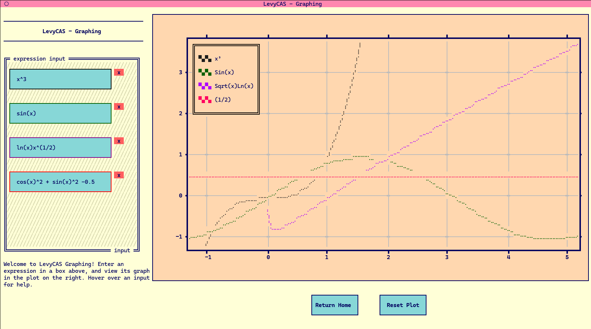
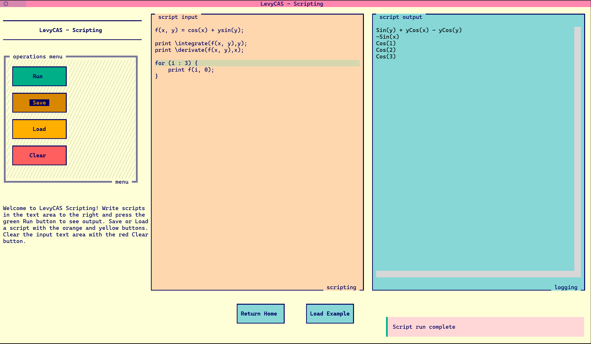

# Welcome to LevyCAS!

LevyCAS is a simple but robust computer algebra system that is designed around the processing of natural language expressions. LevyCAS comes equipped with a variety of  calculus and simplification operations acting on arbitrary algebraic expressions.




<br/>

# Installation:
LevyCAS is uploaded as a Python package on the TestPyPi index [here](https://test.pypi.org/project/levycas/). The base package has no dependencies. Install with pip:

```bash
python3 -m pip install --index-url https://test.pypi.org/simple/ levycas
```

To use the textual user interface, install with the `tui` extra. This extra depends on the [`Textual`](https://textual.textualize.io/) library, as well as the `textual-plot` package.

```bash
python3 -m pip install --extra-index-url https://test.pypi.org/simple/ levycas[tui]
```

<br/>

# Textual User Interface

By default, installing the `tui` extra adds the `levycas` script to PATH. Launch the powerful interface to write scripts or plot expressions:



<br/>

# Package & Repo

The base package consists of a set of core expression objects in [`expressions/`](./src/levycas/expressions/__init__.py), along with routines acting on them in [`operations/`](./src/levycas/operations/__init__.py). The base package consists of a set of core expression objects, along with a set of routines acting on them. In addition, I'm quite proud of the native Pratt parser, capable of turning easy-to-write strings into symbolic expressions. 

### [`src/levycas/`](./src/levycas/__init__.py)
- [`expressions/`](./src/levycas/expressions/__init__.py): Here, you'll find the base classes that all symbolic expressions are made of. Each is expression is represented as a tree consisting of these objects. The implementation of these objects heavily relies on the magic of Python's operator overloading and inheritence.

- [`operations/`](./src/levycas/operations/__init__.py): The routines consist of both the fundamental simplification operations (`simplify`, `sym_eval`), as well as useful symbolic computations like `derivative` and `integrate`. 

- [`parser/`](./src/levycas/parser/__init__.py): All of the Pratt parsing logic is contained here. Lexing converts and input string into tokens, and the parsing logic converts it to native objects.

- [`cli/`](./src/levycas/cli/__init__.py): All of the logic for the textual user interface is contained here. This submodule does not expose any external routines, but the scripts here may interesting to those building simple Textual apps themselves.

<br/>

# Examples:

### Parse
```python
>>> from levycas import parse

>>> parse("sin(x)cosx")
Sin(x)Cos(x)

>>> parse("ax^2 + bx + c")
ax² + bx + c

>>> parse("1/2x + 3ln(x^2)")
6Ln(x) + (1/2)x
```

### Integer Radical
```python
>>> from levycas import factor_integer

>>> def rad(n: Integer) -> Integer:
>>>     rad, factors = 1, factor_integer(n).keys()
>>>     for factor in factors:
>>>         rad *= factor
>>>     return rad

>>> rad(18)
6
```

### Integer Operations
```python
>>> from levycas import is_prime, factor_integer, gcd

>>> gcd(2**4 * 3**5 * 5**3, 7**4 * 11**4 * 13**5)
1

>>> factor_integer(2**4 * 3**5 * 5**3 * 7**9)
{2: 4, 3: 5, 5: 3, 7: 9}
```


### Symbolic Integration
```python
>>> from levycas import Variable, integrate, Sin, Cos, Ln
>>> x = Variable("x")

>>> integrate(Sin(x) * Cos(x), x)
-(1/2)(Cos(x)^2)

>>> integrate(4*x**3 + 3*x**2 + 2*x + 1, x)
x + x² + x³ + x⁴

>>> integrate(Ln(x), x)
-x + xLn(x)
```

### Symbolic Derivatives
```python
>>> from levycas import Variable, derivative, Cos, Ln
>>> x = Variable('x')

>>> derivative(-(1 / 2) * (Cos(x)**2), x)
Sin(x)Cos(x)

>>> derivative(x**4 + x**3 + x**2 + x, x)
1 + 2x + 3x² + 4x³

>>> derivative(x * Ln(x) - x, x)
Ln(x)
```

### Partial Fractions and Rationalization
```python
>>> from levycas import Variable, rationalize
>>> from levycas import univariate_partial_fractions as partial
>>> x = Variable('x')

# (8x+7) / (x+2)(x-1) -> 3/(x+2) + 5/(x-1)
>>> partial(8*x + 7, x + 2, x - 1, x)
(3, 5)

# 3 / (x+2) + 5 / (x-1) -> (8x+7) / (x+2)(x-1)
>>> rationalize(3 / (x + 2) + 5 / (x - 1))
((x + -1) ^ -1) · ((x + 2) ^ -1) · (8x + 7)
